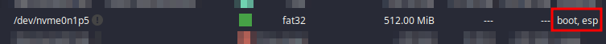

# solus-install
### Solus budgie works great on the Legion 5 15ARH05 with support for nvidia, brightness, trackpad and good battery life.

 

## Installation :
 (Dual boot Solus and Windows 10 with seperate EFIs)
- Solus requires a minimum 500mb EFI so **either** [resize windows EFI](https://superuser.com/questions/1230741/how-to-resize-the-efi-system-partition) or use 2 EFIs and choose between them in the boot device selection menu. This is on a UEFI system
- Windows 10 :
  - Shrink (C:) partition using `diskmgmt.msc`
  - Disable fast startup in power options
- Boot into Solus while on hybrid mode
- Launch GParted :
  - Create 3 partitions in free space you made before
    - 512mb as **FAT32**
    - Optional  4096mb as **linux-swap** (Change this amount, depending on your systems ram, or you can skip this)
    - Remaining as **EXT4**
  - After created, right click and assign `boot` flag to the *512mb FAT32 EFI*
  - The windows 10 installation also has a 100mb FAT32 EFI file, right click and uncheck the `boot` flag
  - Making sure there is only 1 partition with the "``boot,esp``" flags, the other EFI for windows is likely now flagged as *msftdata*
  
- Close Gparted and **restart** to prevent the installer from being stuck on the "Examining local storage" operation
- Run the installer, in the *Disks* section :
  - Choose the option to assign mount points
  - Find the EXT4 partition we made in Gparted, and choose `/` as the mount point
  - If you created a swap earlier, find the 4096mb linux-swap partition, and choose `swap`
- The next section lets you choose the bootloader location. The 512mb EFI should automatically be selected.
- After the installer is done, **open Gparted again** :
  - Assign `boot` to the Windows 100mb EFI
  - Now both, the 100mb and 512mb partitions should be flagged as `boot,esp`
- Now you can change the boot order in UEFI settings
- ### **To boot between the operating systems :**
  - Find the key for accessing the boot device menu
  - Manufacturers should have the same boot menu keys across their products, so [look here](https://www.disk-image.com/faq-bootmenu.htm)
  - When starting up, press that key and you can choose which one to boot
  - If you want a *friendlier* way to switch, you can copy the windows EFI into solus's and [configure clr-boot-manager to detect it](https://gist.github.com/Astro36/d4dd029ee07a1616f65dbd89e7d9a7dc).  
  
#### **Solus Help Center Articles :** [Disk installation](https://getsol.us/articles/installation/disks/en/), [Boot management](https://getsol.us/articles/troubleshooting/boot-management/en/)
 

## Post Install :
- `sudo eopkg up`
- `sudo eopkg remove libreoffice-common hexchat thunderbird`
- `#sudo epokg install wine wine32`
- `sudo eopkg install flameshot paper-icon-theme menulibre python3 htop ant-dracula-gtk-theme openjdk-8 protonvpn-cli git gconf binutils httpd`
- [virtualbox kernel config](https://getsol.us/articles/software/virtualbox/en/)
- enable backlight + blacklist nouveau
  - `sudo su`
  - `echo "amdgpu.backlight=0 modprobe.blacklist=nouveau" > /etc/kernel/cmdline`
  - `clr-boot-manager update`
- [flatpak](https://flatpak.org/setup) setup
  - `sudo eopkg install flatpak xdg-desktop-portal-gtk`
  - `flatpak remote-add --if-not-exists flathub https://flathub.org/repo/flathub.flatpakrepo`
  - `sudo reboot`